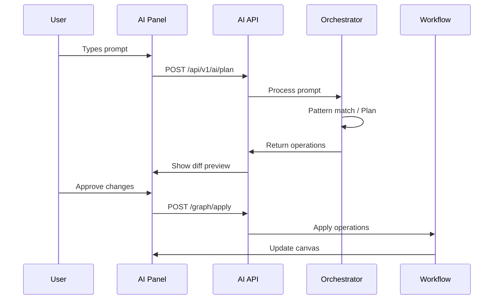

# 🚀 n8n-AI Unified Integration Guide

## Overview

This guide explains how the unified n8n-AI application works, combining all AI features into a single n8n instance.

## Architecture

```
┌────────────────────────────────────────────┐
│           n8n (Main Application)            │
├────────────────────────────────────────────┤
│  ┌─────────────┐     ┌─────────────────┐   │
│  │   Editor    │     │  AI Plugin      │   │
│  │   Canvas    │────▶│  - API Routes   │   │
│  │             │     │  - UI Component │   │
│  └─────────────┘     └────────┬────────┘   │
│                               │             │
│  ┌─────────────────────────────▼────────┐   │
│  │     Embedded Orchestrator            │   │
│  │  - Pattern Matching                  │   │
│  │  - Workflow Planning                 │   │
│  │  - Operation Validation              │   │
│  └──────────────────────────────────────┘   │
└────────────────────────────────────────────┘
```

## Key Components

### 1. AI Plugin (`n8n-plugin.ts`)
- Integrates into n8n at startup
- Adds API routes under `/api/v1/ai/*`
- Injects UI components
- Manages embedded orchestrator

### 2. UI Components
- **AIFirstTool.vue** - Main AI panel (button + chat interface)
- **DiffPreviewModal.vue** - Shows workflow changes before applying
- **SecretsWizardModal.vue** - Guides through credential setup

### 3. Embedded Orchestrator
- Runs in the same process as n8n
- No separate port needed
- Handles all AI operations

## How It Works

### User Flow

1. **User opens n8n** → Normal n8n interface
2. **Sees "AI-first tool" button** → Bottom right corner
3. **Clicks or presses Cmd+K** → AI panel slides up
4. **Types request** → "Create HTTP request to API"
5. **AI processes** → Shows loading state
6. **Diff preview modal** → Review changes
7. **User approves** → Changes applied to canvas
8. **Credentials needed?** → Secrets wizard opens
9. **Complete** → Workflow ready to run

### Technical Flow



## Configuration

### Environment Variables

```bash
# Required
N8N_AI_ENABLED=true
OPENAI_API_KEY=sk-...

# Optional
N8N_AI_ORCHESTRATOR_MODE=embedded  # or 'external'
N8N_AI_UI_POSITION=bottom          # or 'right', 'modal'
```

### Docker Compose

```yaml
services:
  n8n-ai:
    image: n8n-ai-unified:latest
    environment:
      - N8N_AI_ENABLED=true
      - OPENAI_API_KEY=${OPENAI_API_KEY}
    ports:
      - "5678:5678"
```

## Development

### Building from Source

```bash
# Install dependencies
pnpm install

# Build unified package
pnpm -C packages/n8n-ai-unified build

# Build Docker image
docker build -f Dockerfile.unified -t n8n-ai-unified .
```

### Local Development

```bash
# Watch mode for unified package
pnpm -C packages/n8n-ai-unified dev

# Test with local n8n
N8N_AI_ENABLED=true n8n start
```

## Customization

### UI Position

Change where the AI panel appears:

```typescript
// Bottom (default) - slides up like execution logs
N8N_AI_UI_POSITION=bottom

// Right - sidebar like node panel
N8N_AI_UI_POSITION=right

// Modal - centered popup
N8N_AI_UI_POSITION=modal
```

### Custom Patterns

Add your own workflow patterns:

```typescript
// packages/n8n-ai-orchestrator/src/patterns/custom.ts
export const customPatterns = [
  {
    name: 'my-pattern',
    triggers: ['custom trigger phrase'],
    operations: { /* ... */ }
  }
];
```

### Styling

Match your brand:

```scss
// Override CSS variables
.ai-first-tool {
  --ai-primary-color: #your-color;
  --ai-panel-height: 450px;
}
```

## Troubleshooting

### AI button doesn't appear
1. Check `N8N_AI_ENABLED=true`
2. Verify API key is set
3. Check browser console for errors

### Operations fail to apply
1. Check workflow is not read-only
2. Verify node types are available
3. Check orchestrator logs

### Credentials wizard issues
1. Ensure credentials are allowed in n8n
2. Check credential type support
3. Verify connection to services

## Security Considerations

1. **API Keys** - Store securely, never commit
2. **Rate Limiting** - Enabled by default
3. **CORS** - Configure allowed origins
4. **Audit Log** - Track all AI operations

## Performance

- Pattern matching: ~50ms
- AI planning: 1-3s (depends on provider)
- Operation application: <100ms
- UI updates: Real-time

## Future Enhancements

1. **Multi-language support**
2. **Voice input**
3. **Workflow templates library**
4. **Collaborative AI editing**
5. **Custom AI providers**

## Support

- GitHub Issues: [your-repo/issues]
- Documentation: [docs-site]
- Community: [discord/forum]